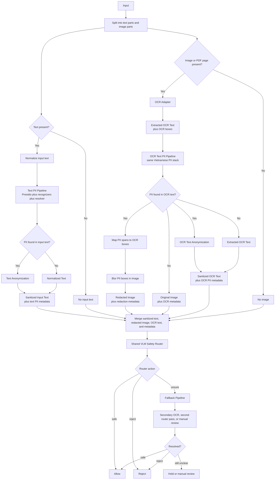

# Full Safety Pipeline

This document describes the full safety pipeline for text, image, and mixed
image-plus-text inputs.

The central rule is:

```text
Every artifact must pass through the shared VLM safety router before allow.
```

Deterministic OCR, Presidio detection, and redaction remain important
preprocessing guardrails, but they are not the final safety decision.

## Scope

This full pipeline is meant to cover:

- Vietnamese PII detection and anonymization
- prompt injection detection
- topic safety classification
- fallback handling for uncertain cases

It does **not** assume one model does everything. Instead, it composes:

- deterministic text PII detection
- OCR-assisted image PII detection
- localized image redaction
- shared VLM safety routing for all modalities
- explicit routing and policy rules

## Combined Flow



## Design Principles

### 1. PII redaction comes before the shared model

For both text and image inputs, PII should be removed before the content is
passed deeper into later stages.

- text input -> anonymize text spans
- image input -> redact image regions

The VLM router receives the redacted artifact plus metadata. It checks whether
redaction failed or whether other safety risks remain.

### 2. Branches merge before the final router

The input is split into text and image branches first. Each branch removes or
marks PII with the deterministic pipeline, then the sanitized artifacts are
merged into one model input package.

The package can contain:

- sanitized input text
- redacted image
- sanitized OCR text
- Presidio spans
- OCR boxes and confidence
- redaction metadata

The final decision still comes from one shared model interface.

### 3. Routing must stay auditable

Every decision should have a clear source:

- text recognizer output
- OCR output
- redaction metadata
- VLM router output
- fallback outcome

This is better than hiding all decisions inside a single opaque label.

## Text Path

The text path reuses the current repository design:

1. normalize input text
2. run the Vietnamese PII pipeline
3. anonymize text if needed
4. pass sanitized text and PII metadata to the merger

The text branch does not make the final safety decision. It only prepares the
text portion for the merged router input.

Text-only rows are valid router inputs. The image field is simply absent.

## Image Path

The image path extends the current system:

1. OCR the image or page
2. normalize OCR text and boxes
3. run the same Vietnamese PII pipeline on OCR text
4. map spans back to boxes
5. blur or otherwise redact PII boxes
6. pass the redacted image, sanitized OCR text, OCR confidence, and redaction
   metadata to the merger

This keeps the current text PII logic reusable rather than replacing it with a
pure VLM solution.

## Merge Before Model

After preprocessing, the text and image branches are merged into one router
input package. This is the only input the shared VLM safety router sees.

For text-only samples, the package contains sanitized text and no image. For
image-only samples, it contains the image and any OCR text that could be
extracted. For mixed samples, it contains both sanitized input text and the
redacted image with sanitized OCR text.

## Shared VLM Safety Router

The shared model is the only component that can return final `safe`, `reject`,
or `unsure` for downstream use.

Recommended near-term target:

```text
Qwen2.5-VL-3B-Instruct with LoRA or QLoRA
```

Compute-limited prototype:

```text
Qwen3-0.6B text-only classifier over OCR text
```

The router may consume:

- text-only input
- image-only input
- image plus OCR text
- redacted image
- OCR text
- Presidio spans
- redaction metadata
- OCR confidence summary

See [vlm-safety-router.md](vlm-safety-router.md) for the model interface,
training output format, and classifier-head alternative.

## Router Output

The first implementation should force a flat JSON object:

```json
{
  "action": "safe",
  "pii_visible": false,
  "prompt_injection": false,
  "sexual": false,
  "violence": false,
  "blood_gore": false,
  "political": false,
  "religious": false
}
```

Allowed actions:

```text
safe
reject
unsure
```

If model output cannot be parsed or validated, route as `unsure`.

## Multi-Head Training

The dataset should support partial labels through masks:

```text
loss =
  mask_pii * BCE(pii_visible)
+ mask_prompt * BCE(prompt_injection)
+ mask_visual * BCE(sexual, violence, blood_gore)
+ mask_topic * BCE(political, religious)
+ mask_action * CE(action)
```

This allows one dataset to mix:

- image-only visual safety rows
- text-only prompt injection rows
- image plus OCR document rows
- PII redaction success and failure rows
- topic filtering rows

Unknown labels must be masked out, not treated as negative.

## Fallback Pipeline

The fallback pipeline should be shared at the policy level, even if the
implementation differs by modality.

Trigger fallback when:

- the router returns `unsure`
- OCR quality is poor
- the router says PII is still visible after redaction
- prompt injection evidence is weak or conflicting
- topic classification is ambiguous
- model output is malformed or incomplete

Fallback options:

- stronger OCR
- second router pass
- stricter prompt injection rules
- additional review model
- manual review

## Policy Examples

### Text input

1. Detect PII spans.
2. Anonymize text if spans exist.
3. Package anonymized text and PII metadata.
4. Run the shared VLM safety router.
5. Reject if action is `reject`.
6. Send to fallback if action is `unsure`.
7. Allow only if action is `safe`.

### Image input

1. OCR the image.
2. Detect PII spans from OCR text.
3. Redact detected image regions.
4. Package redacted image, OCR text, and redaction metadata.
5. Run the shared VLM safety router.
6. Reject if action is `reject`.
7. Send to fallback if action is `unsure`, including possible missed PII.
8. Allow only if action is `safe`.

## Why Keep Deterministic Preprocessing

The shared model is the final router, but deterministic preprocessing is still
needed:

- Presidio gives exact text spans for anonymization.
- OCR boxes are needed to redact image regions.
- Redaction metadata lets the router check whether the final artifact is safe.
- Deterministic steps are easier to audit and improve.

The VLM should not replace localized redaction. It should judge the final
artifact after redaction.

## Dataset Contract

Use one dataset schema that can represent all modalities:

```json
{
  "input_id": "safety_v0_000001",
  "original_image_path": "data/raw/000001.png",
  "redacted_image_path": "data/redacted/000001.png",
  "ocr_text": "OCR text if available",
  "presidio_spans": [],
  "redaction_metadata": [],
  "labels": {
    "action": "reject",
    "pii_visible": false,
    "prompt_injection": false,
    "sexual": false,
    "violence": true,
    "blood_gore": true,
    "political": false,
    "religious": false
  },
  "label_mask": {
    "action": 1,
    "pii_visible": 1,
    "prompt_injection": 1,
    "visual_safety": 1,
    "topic": 1
  }
}
```

For text-only rows, `redacted_image_path` is `null`. For image-only rows,
`ocr_text` may be empty and OCR metadata may be absent.

## Recommended Near-Term Build Order

1. Keep the current text pipeline stable.
2. Add image OCR normalization and redaction.
3. Add the shared VLM safety router interface.
4. Start with strict generative JSON output.
5. Add validation, fallback routing, and audit logging.
6. Build a mixed seed dataset with image-only, text-only, and image-plus-text
   samples.
7. Later, replace or supplement generative JSON with explicit classifier heads
   if thresholds and faster inference become important.
