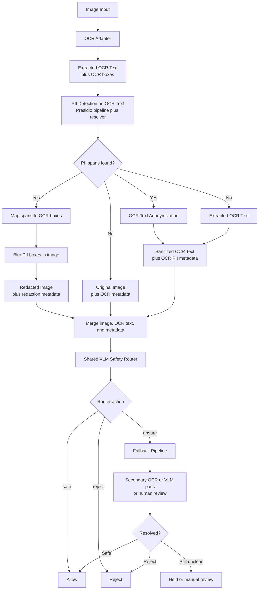

# Image Safety Pipeline

This document proposes a multimodal safety pipeline for image inputs such as
screenshots, scanned forms, receipts, and document photos.

The design keeps **PII redaction** separate from **final safety routing**:

- OCR and Presidio-style PII detection handle localized redaction.
- A shared VLM safety router handles final `safe`, `reject`, or `unsure`.
- A fallback pipeline handles cases where OCR or the VLM is not confident.

## Goals

- Redact Vietnamese PII from images before downstream use.
- Reject prompt-injection images and disallowed topics.
- Keep routing explicit and auditable.
- Preserve modularity so OCR, PII detection, and VLM models can be swapped
  independently.

## Proposed Flow

## Why This Order

PII should be anonymized before later multimodal classification stages reuse the
image. A page-level VLM label such as `contains_pii` is useful for routing, but
it does not tell us **what exact regions to redact**.

That is why the first stage is:

1. OCR
2. text-based PII detection
3. image redaction

Only after that should the shared VLM safety router decide whether the artifact
is safe, unsafe, or uncertain.

## Stage Breakdown

### 1. OCR Adapter

Input:

- image page

Output:

- extracted text
- token, word, or line bounding boxes
- reading order metadata
- OCR confidence if available

This should sit behind a narrow interface so we can switch OCR providers without
changing pipeline logic.

### 2. OCR-Normalized Text Representation

The OCR output should be normalized into a shared structure:

- `full_text`
- `segments`
- each segment has:
  - `text`
  - `start_char`
  - `end_char`
  - `box`
  - `confidence`

This representation is the bridge between text PII detection and image
redaction.

### 3. PII Detection on OCR Text

This stage reuses the existing Vietnamese PII stack:

- regex recognizers
- optional NER recognizers
- optional deterministic resolver
- optional verifier later if needed

The output is still standard text spans such as:

- `entity_type`
- `start`
- `end`
- `score`

### 4. Span-to-Box Mapping

Detected text spans must be converted back into image regions.

This component should:

- align character spans to OCR segments
- merge overlapping boxes
- optionally expand boxes with small padding
- preserve audit metadata for each redaction

This is the core image-specific anonymization step.

### 5. Image Redaction

The redaction engine should support:

- blur
- solid fill
- optional per-entity styling later

The output should include:

- redacted image
- redaction metadata
- mapping from entity spans to final boxes

### 6. Shared VLM Safety Router

The VLM router should be a final artifact classifier, not the primary redactor.
It should consume the redacted image by default, not the unredacted original.
The original image can be kept for audit or offline error analysis, but the
normal deployment input should be the redacted artifact.

Recommended output fields:

- `action`: `safe | reject | unsure`
- `pii_visible`: `true | false`
- `prompt_injection`: `true | false`
- `sexual`: `true | false`
- `violence`: `true | false`
- `blood_gore`: `true | false`
- `political`: `true | false`
- `religious`: `true | false`

This model can use:

- the redacted image
- the OCR text
- Presidio spans and redaction metadata
- optional OCR confidence summary

See [vlm-safety-router.md](vlm-safety-router.md) for the shared model contract.

### 7. Fallback Pipeline

Fallback should handle:

- router returns `unsure`
- router says PII is still visible after redaction
- OCR confidence is too low
- OCR text is incomplete or visually noisy

Possible fallback actions:

- stronger OCR model
- second-pass VLM prompt
- stricter text recognizer run
- manual review queue

## Policy Logic

A simple first-pass routing policy:

1. Run OCR and text PII detection.
2. If PII spans are found, redact those boxes first.
3. Run the shared VLM safety router on the redacted image plus OCR metadata.
4. Apply explicit policy:
   - `action=safe` -> allow
   - `action=reject` -> reject
   - `action=unsure` -> fallback

This keeps policy decisions auditable and avoids hiding them inside one opaque
flat label space.

## Why Not One Flat VLM Label

A single label space such as:

- `safe`
- `unsure`
- `pii`
- `prompt_injection`
- `political`
- `religious`
- `sexual`

looks simple, but it combines different tasks:

- localized redaction
- content moderation
- attack detection

Those tasks should remain separable because they require different evaluation
sets, have different error costs, and evolve at different speeds.

## Recommended First Milestone

Build the smallest end-to-end version first:

1. image input
2. OCR output with word boxes
3. existing Vietnamese `regex_recall` pipeline on OCR text
4. box redaction
5. shared VLM safety routing
6. fallback on `unsure`

This is enough for a demo and keeps the current text pipeline reusable.

## Open Questions

- Which OCR provider should be the default?
- Do we support images only, PDFs only, or both?
- Should fallback be a second model pass or manual review first?
- Which disallowed topic taxonomy do we want for the internship scope?
- What threshold should route `pii_visible=true` to reject instead of unsure?

## Suggested Implementation Order

1. Add OCR normalization types and interfaces.
2. Add span-to-box mapping and image redaction.
3. Add an image pipeline wrapper around the existing Vietnamese PII pipeline.
4. Add a shared VLM safety router interface with explicit multi-head outputs.
5. Add fallback routing and audit logging.
6. Add a small seed evaluation set for image safety flows.
