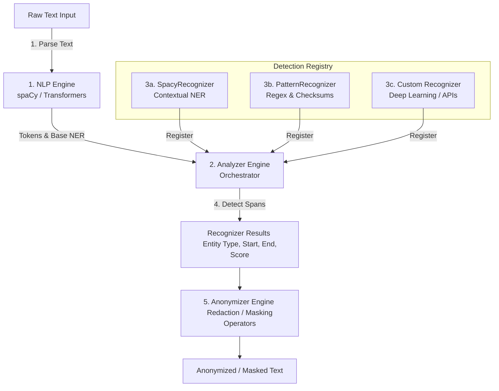

```mermaid
graph TD
    Text[Raw Text Input] -->|1. Parse Text| NLPEngine[1. NLP Engine <br> spaCy / Transformers]
    NLPEngine -->|Tokens & Base NER| Analyzer[2. Analyzer Engine <br> Orchestrator]
    
    subgraph Detection Registry
        Rec1[3a. SpacyRecognizer <br> Contextual NER]
        Rec2[3b. PatternRecognizer <br> Regex & Checksums]
        Rec3[3c. Custom Recognizer <br> Deep Learning / APIs]
    end
    
    Rec1 -->|Register| Analyzer
    Rec2 -->|Register| Analyzer
    Rec3 -->|Register| Analyzer
    
    Analyzer -->|4. Detect Spans| Results[Recognizer Results <br> Entity Type, Start, End, Score]
    Results --> Anonymizer[5. Anonymizer Engine <br> Redaction / Masking Operators]
    Anonymizer --> Output[Anonymized / Masked Text]
```
